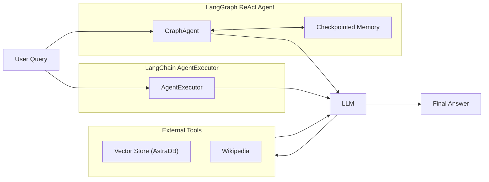

# Multi-Tool Stateful Agent Systems with LangChain, LangGraph and AstraDB

A **stateful agentic Question–Answering system** that demonstrates two different execution paradigms for tool-using LLM agents:  
a traditional **LangChain AgentExecutor** and a **LangGraph-based ReAct agent with persistent memory**.

The project integrates **LangChain**, **LangGraph**, and **AstraDB** to showcase dynamic tool routing, vector-based retrieval, and graph-based orchestration for multi-turn reasoning.

This implementation emphasizes **agent reasoning, state management, and system-level design**, rather than UI or prompt-only workflows.

---

## Features

- ReAct-style tool-using agents  
- Dynamic tool selection (vector store + Wikipedia)  
- Vector-based semantic retrieval using AstraDB  
- Stateful, multi-turn conversations via LangGraph  
- Persistent memory with checkpointing  
- Execution trace inspection  
- Graph visualization of agent flow  

---

## Architecture


## Environment Setup

This project supports running in **Google Colab** or **locally**.

---

### Option 1: Google Colab

The notebook was developed and tested in **Google Colab**.

Before running, configure the following secrets using **Colab Secrets Manager**:

- `ASTRA_DB_APPLICATION_TOKEN`
- `ASTRA_DB_ID`
- `GROQ_API_KEY`

**Steps:**
1. Open **Runtime → Secrets**
2. Add each key with its corresponding value
3. Restart the runtime

The notebook automatically loads these values at execution time.

---

### Option 2: Local Setup

When running locally, install requirements.txt and secrets should be provided via a `.env` file using `python-dotenv`.

#### 1. Create a `.env` file

```env
ASTRA_DB_APPLICATION_TOKEN=your_token_here
ASTRA_DB_ID=your_database_id
GROQ_API_KEY=your_groq_api_key

